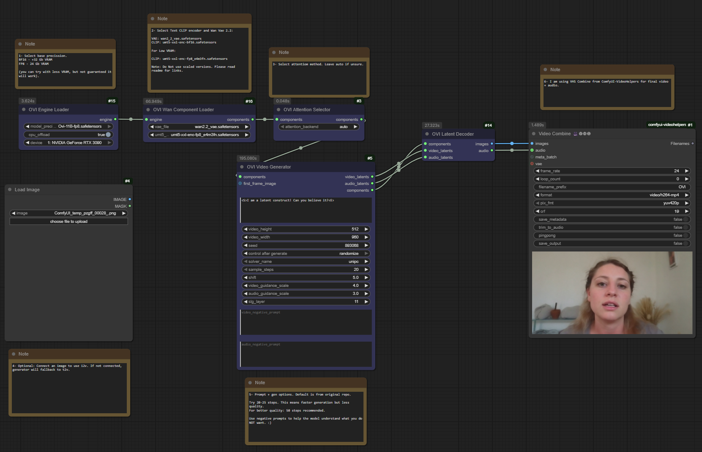

# ComfyUI-Ovi

Custom nodes that bring Character.AI's **Ovi** video+audio generator to ComfyUI with streamlined setup, selectable precision, attention-backend control, and per-node device targeting for multi-GPU rigs.

---



## Key Features

- **Self-bootstrapping loader** – downloads MMAudio assets and the chosen Ovi fusion weights to `custom_nodes/ComfyUI-Ovi/ckpts`, then places the OVI safetensors in `models/diffusion_models/`.
- **Precision toggle** – pick **Ovi-11B BF16** or the 16-24 GB-friendly **Ovi-11B FP8** from a dropdown; each mode is cached separately.
- **Optional CPU offload** – move large modules to system RAM when VRAM is tight.
- **Attention selector** – flip between `auto`, FlashAttention, SDPA, Sage, etc., at runtime.
- **Component reuse** – keep using the Wan 2.2 VAE and UMT5 text encoder you already installed (no duplicated files!); the component loader will point to the correct location (see below).
- **Dloader** - auto-detects available GPUs; single-GPU setups hide the selector, while multi-GPU rigs get a dropdown to pick the target device.

---

## Requirements

- **GPU**: 16-24 GB (FP8 + offload) or >32 GB+ (BF16 without offload)
- **CUDA stack**: PyTorch 2.4+, CUDA 12.x driver/runtime
- **SageAttention**: compile and install the [SageAttention](https://github.com/woct0rdho/SageAttention/tree/2.2.0) backend before running these nodes. If Sage is not compiled and installed (both), the video output will consist only of noise.

---

## Installation

```bash
# from ComfyUI/custom_nodes
git clone https://github.com/snicolast/ComfyUI-Ovi.git
cd ComfyUI-Ovi
pip install -r requirements.txt
```

Restart ComfyUI after installing.

---

## Weights Overview

Handled **automatically** by **Ovi Engine Loader**:

- `MMAudio/ext_weights/{best_netG.pt, v1-16.pth}`
- `Ovi-11B-bf16.safetensors` or `Ovi-11B-fp8.safetensors` (renamed and parked in `models/diffusion_models/`)

Provide manually if missing (usually already present in Wan setups). Choose only one text encoder:

- BF16 (>32 GB VRAM) -> [`umt5-xxl-enc-bf16.safetensors`](https://huggingface.co/Kijai/WanVideo_comfy/blob/main/umt5-xxl-enc-bf16.safetensors) → `models/text_encoders`
- FP8 (16-24 GB VRAM) -> [`umt5-xxl-enc-fp8_e4m3fn.safetensors`](https://huggingface.co/Kijai/WanVideo_comfy/blob/main/umt5-xxl-enc-fp8_e4m3fn.safetensors) → `models/text_encoders`
- [`wan2.2_vae.safetensors`](https://huggingface.co/Comfy-Org/Wan_2.2_ComfyUI_Repackaged/blob/main/split_files/vae/wan2.2_vae.safetensors) → `models/vae`

Directory sketch:

```
ComfyUI/
├── models/
│   ├── diffusion_models/
│   │   ├── Ovi-11B-bf16.safetensors
│   │   └── Ovi-11B-fp8.safetensors
│   ├── text_encoders/umt5-xxl-enc-bf16.safetensors
│   └── vae/wan2.2_vae.safetensors
└── custom_nodes/ComfyUI-Ovi/ckpts/MMAudio/ext_weights/...
```

---

## Available Nodes

| Node | Description |
| --- | --- |
| **Ovi Engine Loader** | Downloads missing weights, builds the fusion engine, exposes `OVI_ENGINE`, lets you pick precision/offload/device (multi-GPU ready). |
| **Ovi Wan Component Loader** | Optional override so you can point the engine to Wan VAE + UMT5 files stored elsewhere. |
| **Ovi Attention Selector** | Switch attention backend for the live engine (`auto`, FlashAttention, SDPA, xFormers, native, etc.). |
| **Ovi Video Generator** | Runs `OviFusionEngine.generate` and emits video/audio latents plus the engine handle for downstream nodes. |
| **Ovi Latent Decoder** | Takes those latents + engine, performs the VAE decode, and outputs `IMAGE` frames with accompanying `AUDIO` (16 kHz). |

All nodes live under the **Ovi** category in the ComfyUI search dialog.

---

## Quick Start Workflow

1. **Load engine** - drop *Ovi Engine Loader*, choose precision (BF16 vs FP8), enable CPU offload if you are on a 24 GB GPU, select device.
2. **(Optional) Add Wan components** - connect *Ovi Wan Component Loader* if your VAE/encoder live outside the default folders.
3. **Tune attention** - insert *Ovi Attention Selector* to lock a backend, otherwise leave on `auto`.
4. **Generate** - wire the engine into *Ovi Video Generator*, enter your prompt (supports `<S>`...`<E>` speech and `<AUDCAP>`...`<ENDAUDCAP>` audio tags), optionally feed a first-frame image.
5. **Decode** - add *Ovi Latent Decoder*, feed it the engine passthrough plus both latents to obtain `IMAGE` + `AUDIO`.
6. **Export** - connect those outputs to your preferred save nodes.

---

## Tips & Troubleshooting

- **High VRAM after a run** – use ComfyUI’s *Unload Models*; the engine rebuilds itself automatically on next use.
- **Missing weights** – place the files manually in the paths above; the loader skips network calls when files already exist.
- **Switching precision** – changing the dropdown spins up a new cached engine; you can hot-swap without restarting ComfyUI.
- **Backend errors** – if FlashAttention/xFormers is unavailable, the selector falls back to `native`; check the console log for details.
- **Noisy output** – Compile and install SageAttention (2.2.0).

---

## Credits

- *Ovi: Twin Backbone Cross-Modal Fusion for Audio-Video Generation* (Character.AI)
- Wan 2.2 VAE, MMAudio, UMT5 ecosystem maintainers
- Kijai